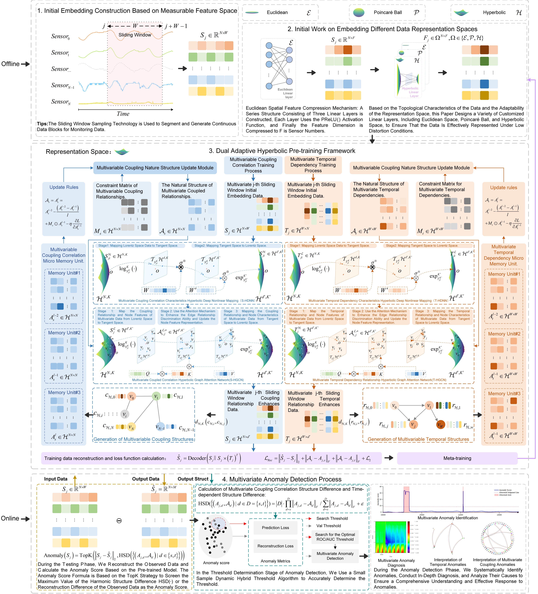
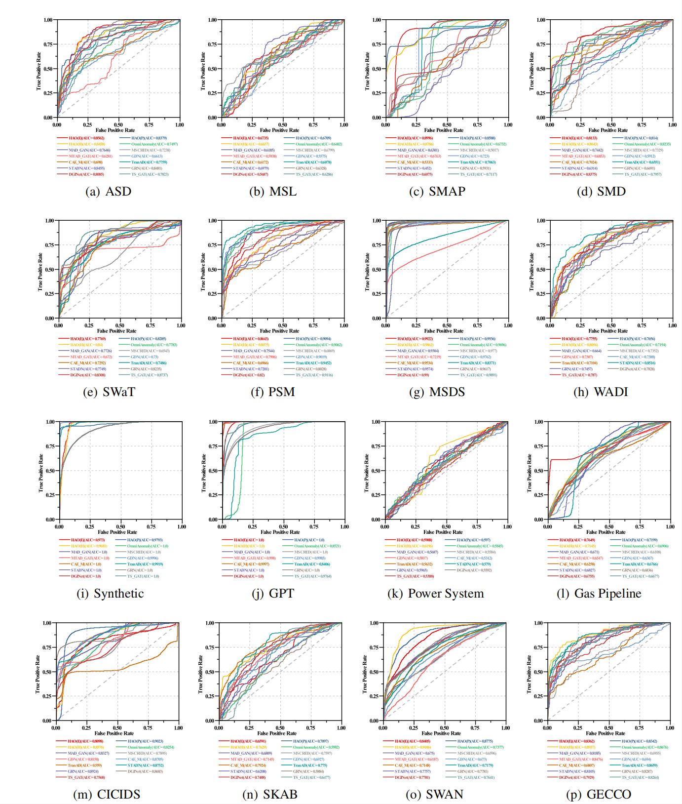
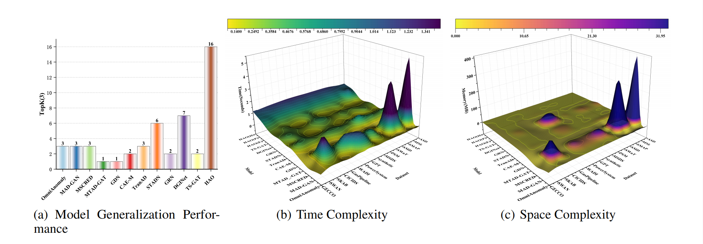
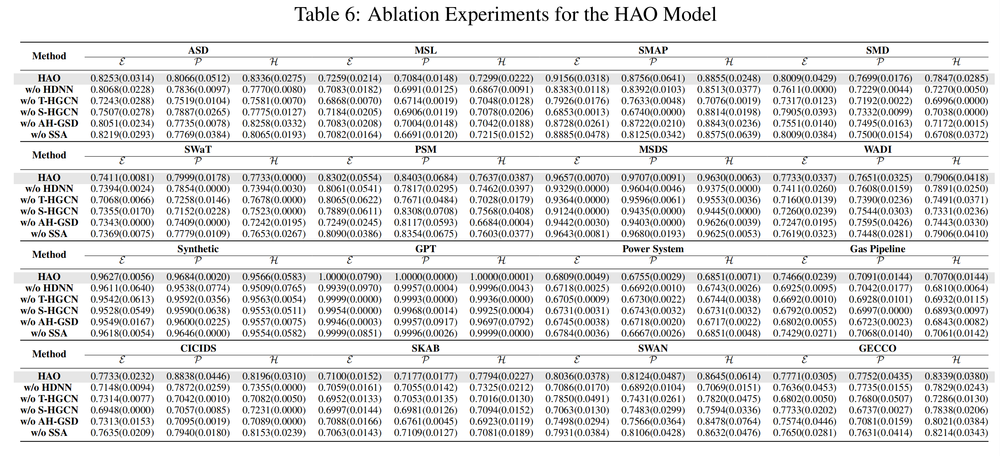
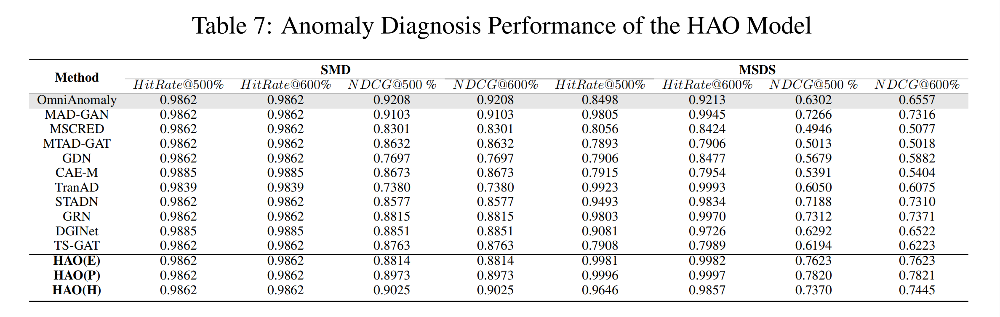
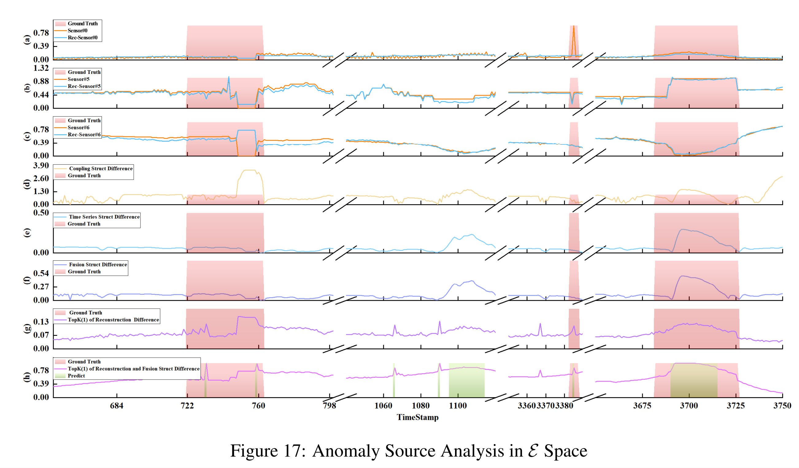
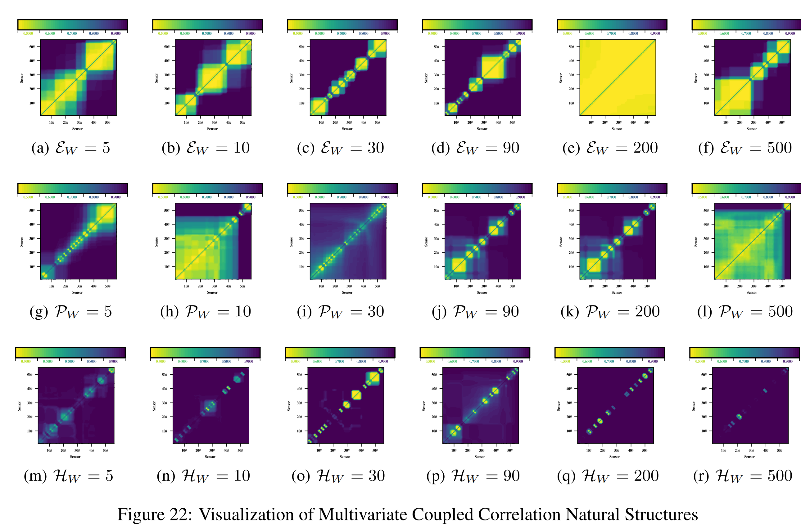

# HAO
Existing multivariate anomaly detection methods have demonstrated good anomaly detection performance and local causation explanation capability at the theoretical validation level. However, these models still face challenges in practical industrial applications due to the limitations of the a priori structural distribution assumptions, the volatility of the data, and the need for ultra-low inference time. To address these issues, we proposes a hyperbolic adaptive spatial-aware multivariate time series anomaly detection method to improve the detection accuracy, interpretability and robustness in practical applications. Firstly, an adaptive curvature hyperbolic pretraining framework based on the hierarchical characteristics of spatio-temporal coupling of multivariate data is designed, which strengthens the potential spatio-temporal coupling relationship in multivariate data by adaptively embedding the data in the hyperbolic space. Secondly, to overcome the rigid constraints of the preset structure on the natural structure of the data, the adaptive hyperbolic graph structure discovery is constructed, which realizes the dynamic generation of the natural structure of the data and the explanation of the global anomaly genesis. Finally, for the problem of insufficient model robustness due to numerical mutation, a small-sample hybrid dynamic threshold determination algorithm is proposed to achieve robust multivariate anomaly detection under multiple constraints. To the best of our knowledge, the hyperbolic adaptive pretraining framework, adaptive hyperbolic graph structure learning, cross-region anomaly interpretation, and the small-sample hybrid dynamic threshold determination algorithm are the first time that they have been proposed and successfully applied to the multivariate anomaly detection task. Experimental results show that the models in this paper exhibit good performance in multivariate anomaly detection tasks, proving the theoretical feasibility and reliability, application accuracy and timeliness of the methods in this paper.
# HAO model framework
The data geometry-driven hyperbolic adaptive spatial-aware multivariate time series anomaly detection model proposed in this paper is a multi-task learning framework that unifies data reconstruction, structure discovery, and geometric parameter learning, aiming to address the following challenges:

(1) We can reduce the rigidity of the predefined structure constraints. By applying physical constraints to different dimensions of the data and using more relaxed constraint conditions, we can minimize the interference of human prior knowledge on the predefined structure.	
(2) We can reduce data topology attribute distortion by optimizing the learning framework through a dual adaptive hyperbolic graph structure, multiple data representation spaces, adaptive curvature adjustment, and dynamic structural optimization to maximize the exploration of structural characteristics suitable for the data.
(3) We can reduce confusion in explaining abnormal causes by optimizing the dual-channel structure mechanism, independently optimizing the temporal dependency relationships and multi-variable coupling relationships of multi-variable data, and improving the reliability of explanations for different abnormal causes.
(4) We can improve the efficiency of dynamic structure optimization. Through customized learning components, we can maximize the representation performance of different data representation spaces, reduce accuracy loss in feature space conversion, and enhance the efficiency of multivariate anomaly detection.
# How to run?
1. Install the operating environment of the HAO model [HAO-Linux_request.txt](HAO-Linux_request.txt).
2. Download the required dataset to [data](data).
3. Run the preprocess.py file to preprocess the downloaded data.
4. Run cmd [main.py](main.py): python main.py --dataset ASD --model HAO --windowsize 5 --epoch 1 --space Euclidea --dataRate 0.9
# Experimental Results Examples
1. Multivariate Anomaly Recognition:
   The core task of multi-variable anomaly recognition is to accurately locate anomalous segments in massive data streams. To evaluate the anomaly recognition model performance of complex interference environments, we designed and conducted a series of extensive comparative experiments. First, we compared the performance of the HAO model with the comparison models listed in Table \ref{tab3}, using the ROC-AUC metric to measure the model's discrimination capability while utilizing the P-R curve and average precision (AP) to assess its ability to balance false positives and false negatives. Second, we designed a small-sample dynamic hybrid anomaly threshold determination algorithm (SSA) and combined it with the threshold-based numerical evaluation method of the comparison models to more accurately quantify the performance of each model in practical applications. Finally, we conducted an in-depth analysis of the spatio-temporal complexity of the HAO model and the impact of its components and key parameters on its robustness. Based on all experimental results, the HAO model demonstrated the best overall anomaly detection performance in complex data source scenarios.
    
    
    
2. Multivariate Anomaly Diagnosis:
   Anomaly source diagnosis aims to accurately distinguish the root cause of anomalies and provide a basis for handling them, but existing research has not explored this area extensively. The main challenge lies in the fact that mainstream models, due to their joint learning of spatio-temporal features, cause anomaly signals to couple and spread, forming a “causal masking effect” that confuses endogenous cumulative anomalies (such as equipment degradation) with exogenous sudden disturbances (such as attacks). Therefore, the HAO model adopts a data geometry-driven framework. On the one hand, it independently decouples spatio-temporal disturbance phenomena, separates and analyzes anomaly dependencies to locate sources; on the other hand, it uses adaptive geometric representation learning to uncover structural characteristics such as hierarchy and community, providing a structured benchmark for causal interpretation.
    
    
3. Multivariate Anomaly Causality Interpretation:
    The essence of multivariate anomaly causality interpretation lies in analyzing anomaly sources and their triggering mechanisms. It plays a pivotal role in discovering novel anomaly types across unknown application scenarios, while serving as a critical feedback and rectification mechanism for inevitable mislabeling and omission issues inherent in manual annotation processes. Consequently, it demonstrates substantial practical significance.
    
# Summary and Discussion
This paper addresses the core challenges faced in practical industrial applications of multi-variable time-series anomaly detection—unknown system topology, distorted data embedding space, ambiguous anomaly explanation dimensions, and dynamic expansion of sensor scale—by proposing an innovative hyperbolic adaptive space-aware model (HAO). This model achieves a complete closed-loop process from anomaly identification and diagnosis to cause explanation through a data geometry-driven modeling paradigm, significantly enhancing detection accuracy, interpretability, and robustness. 