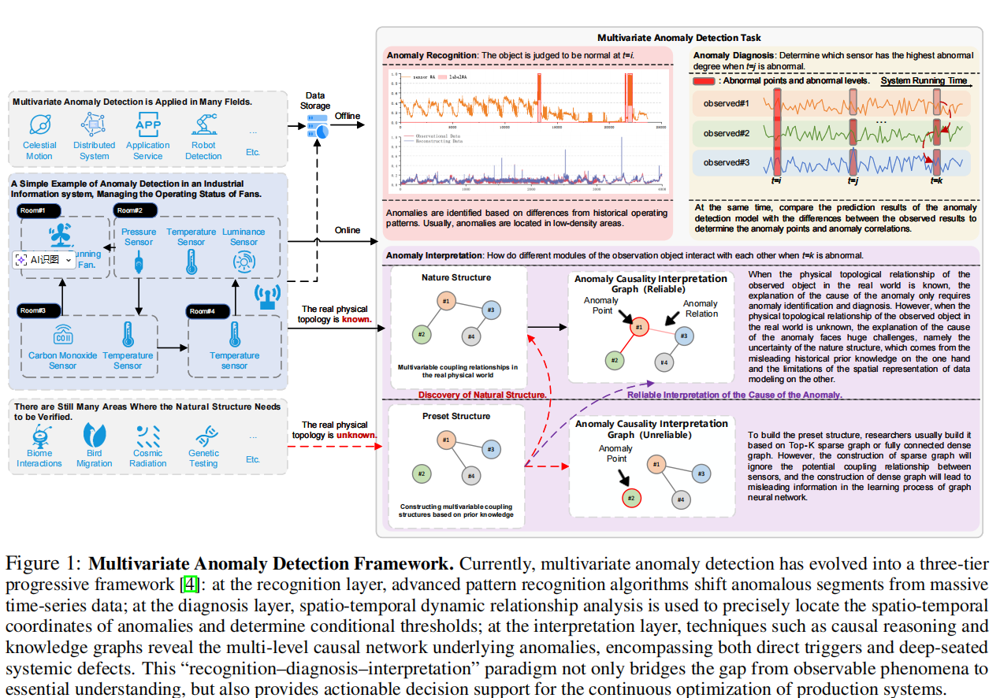
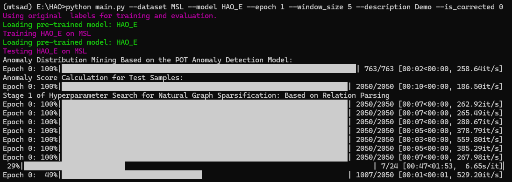
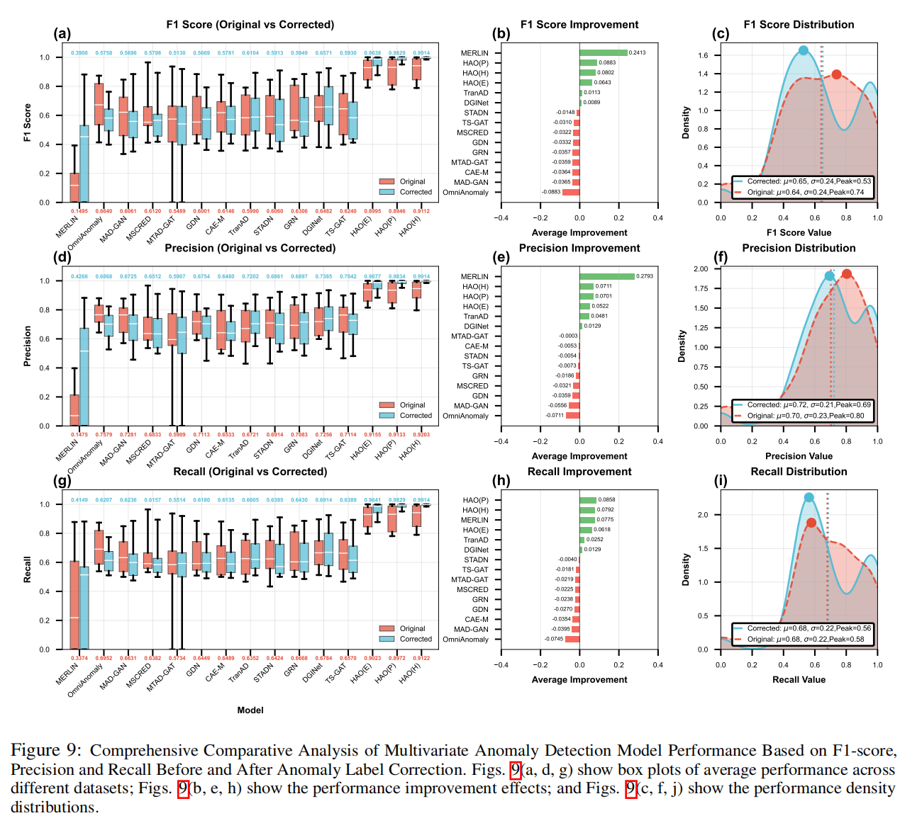
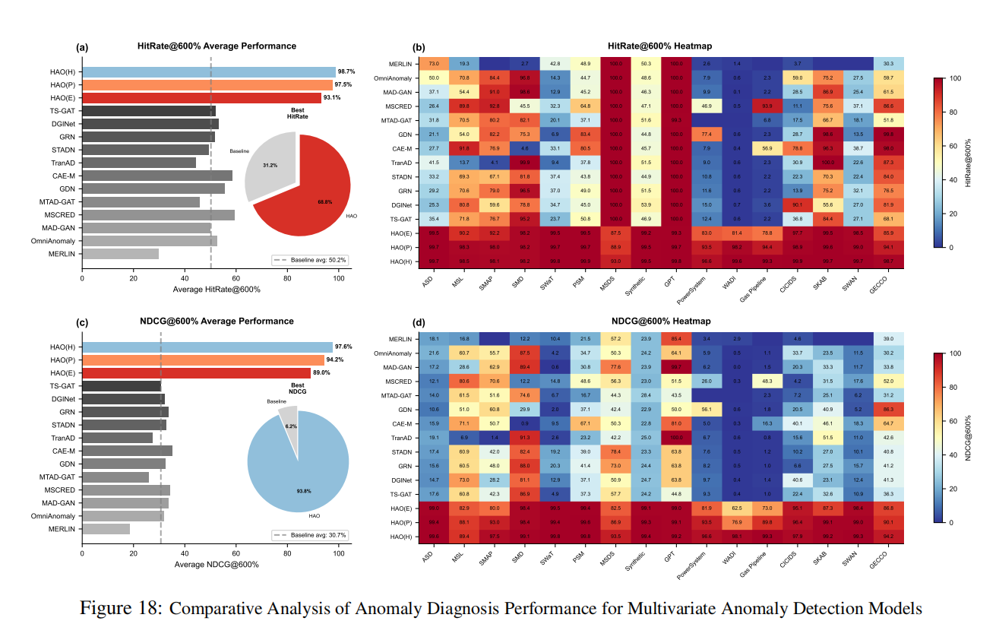

# Hyperbolic Adaptive Spatial-Aware Multivariate Time Series Anomaly Detection
Although existing multivariate anomaly detection methods demonstrate stronger detection performance and local causal explanation capabilities in theoretical validation, their application in practical industrial settings still faces numerous challenges due to assumptions about prior structural distributions, higher data volatility and the need for high-confidence anomaly labeling. To address these issues, this study proposes a hyperbolic adaptive spatial-aware multivariate anomaly detection method aimed at enhancing accuracy, robustness and interpretability in real-world applications. First, we design an adaptive hyperbolic pre-training framework based on hierarchical features of temporal-spatial coupling in multivariate time-series data, which effectively deciphers latent multivariate spatio-temporal correlations by adaptively embedding data into hyperbolic space. Second, we develop an adaptive hyperbolic graph structure discovery and dynamic sparsification approach to overcome rigid constraints imposed by predefined structures on natural data topology, which autonomously generates natural data structures and precisely locates spatio-temporal coordinates of anomalies, providing critical evidence for explaining their causes. Finally, we introduce a multi-level signal parsing attention mechanism and a small-sample hybrid dynamic threshold determination algorithm to tackle insufficient model robustness caused by complex signals,  which enable robust multivariate anomaly detection under multiple constraints. To the best of our knowledge, the proposed adaptive hyperbolic pre-training framework, adaptive hyperbolic graph structure discovery, multivariate anomaly spatio-temporal coordinate localization, multi-level signal parsing attention mechanism and small-sample hybrid dynamic threshold determination algorithm are all introduced here for the first time and successfully applied in this domain. Experimental results show that the proposed model improves performance across various multivariate anomaly detection tasks by 10%-30%. This not only validates the theoretical feasibility and application reliability of the proposed method, but also introduces, for the first time, research and exploration of explainable AI in the field of anomaly detection.	

# Research Motivation
With the continuous advancement of Industrial Internet of Things (IIoT) and information systems, production monitoring sensors play a pivotal role in data acquisition and analysis during manufacturing processes, which is crucial for ensuring production safety and enhancing intelligent operation and maintenance. In current multivariate anomaly detection research tasks, as shown in Fig. 1, challenges  still exist, such as unknown true system topologies, distorted data embedding spaces, conflated dimensions of anomaly interpretation and dynamically expanding sensor scales. Moreover, over-reliance on structural priors has created an “interpretation comfort zone trap” that severely limits anomaly interpretability in dynamic scenarios. Therefore, this study aims to construct an open adaptive mechanism of generalizing interpretation, enabling the maintenance of interpretive credibility and traceability precision even when unknown anomalies emerge. This is not only a key exploration toward advancing industrial cognitive intelligence from “anomaly recognition” to “causal insight”, but also it is critical to decision-making trustworthiness under complex operating conditions.

# Methodology
In complex industrial systems and Internet of Things (IoT) scenarios, anomaly detection in multivariate time-series data faces multiple challenges, including insufficient credibility of anomaly labels, unknown true system topology, distortion in the data embedding space and confusion among anomaly interpretation dimensions. To address these issues, a Hyperbolic Adaptive Spatial-Aware Framework is proposed for Multivariate Time-Series Anomaly Detection, as shown in Fig. 8. By leveraging the hierarchical modelling capabilities of hyperbolic geometry and a dual adaptive hyperbolic pre-training framework, the framework enables the accurate recognition, diagnosis and interpretable analysis of multivariate anomalies.

During the offline pre-training stage, sliding window sampling is first applied to partition multi-sensor time-series data into consecutive segments. The original high-dimensional time-series $S_i \in \mathbb{R}^{N \times W}$ is transformed into initial data chunks suitable for spatial perception, as shown in Fig. 8(a). This process guarantees the continuity and integrity of the monitored data, establishing a high-quality input foundation for subsequent hyperbolic space embedding. Subsequently, an optional linear layer $F_i \in \Omega$, $\Omega \in \{\mathcal{E}, \mathcal{P}, \mathcal{H}\}$ is introduced. This layer maps the initial spatial features $S_i \in \mathbb{R}^{N \times F}$ into Euclidean space $\mathcal{E}$, the Poincaré ball space $\mathcal{P}$, or hyperbolic space $\mathcal{H}$, as shown in Fig. 8(b).

The core of the HAO model framework lies in the dual Adaptive Hyperbolic Pre-training Module, as shown in Fig. \ref{fig8}(c). This module achieves dual adaptive hyperbolic pre-training in both spatial and temporal dimensions through a natural structure update mechanism for multivariate coupling. Specifically, the multivariate coupling natural structure micro-Memory unit dynamically captures the natural coupling relationships among variables via a constraint matrix $A \in \mathcal{H}^{N \times N}$, a memory unit $M \in \mathcal{H}^{N \times N}$ and drives structural evolution using an update rule. Based on this, the Hyperbolic Deep Neural Mapping (HDNM) is divided into two branches: Spatial HDNM ($s$-HDNM) and Temporal HDNM ($t$-HDNM). These map the initial embeddings $\mathcal{H}^{N,K}$ into the tangent space $\mathcal{H}^{N,K'}$ and subsequently map them back to hyperbolic space via the exponential map $\exp_p^x$, capturing spatial dependencies and temporal dependencies, respectively. Next, a multivariate coupling graph structure is generated based on the coupling relation matrix $C_{H,N}$ and an enhanced spatial feature representation is produced via the relation enhancement module. Simultaneously, a multivariate temporal dependency structure and temporally enhanced features are generated. Finally, the multi-level signal parsing attention mechanism fuses the spatially and temporally enhanced features through multi-head attention, computes the attention weights $w_i^e = \sum_{j=1}^L e_{ij} y_j$ and outputs the fused spatio-temporal feature representation. 

During the online detection stage, the model achieves precise anomaly localization and analysis through three core steps: data reconstruction and difference calculation, dynamic threshold determination and multivariate anomaly spatio-temporal coordinate localizetion as shown in Fig. \ref{fig8}(d). First, the pre-trained model is used to reconstruct the observed data $S_i$, yielding $\hat{S}_i$. Anomaly scores are then computed by combining multivariate temporal structural differences and reconstruction differences. Second, a dynamic threshold strategy is adopted, in which the natural graph dynamic norm and the predicted graph norm are used to optimise the threshold $\tau$ and the search threshold $\tau'$, enabling robust anomaly detection for both multivariate coupling and temporal dependencies.  Finally, once anomalous points are identified, the system performs deep diagnosis using the spatio-temporal anomaly coordinates $(t_n, s_n)$ to analyse the root causes, ensuring comprehensive understanding and effective response to complex temporal anomalies. 
# Multivariate Anomaly Label Correction
In the label correction mode, the HAO-series model follows the workflow: (a) → (b) → (c). In the baseline mode without label correction, it follows: (a) → (c).

# Execute
1. Install the operating environment of the HAO model [HAO-Linux_request.txt](HAO-Linux_request.txt).
2. Download the required dataset to [data](data).
    The benchmark datasets used in this study are all publicly available on the Internet and can be accessed through the following URLs:
	ASD: https://github.com/zhhlee/InterFusion/tree/main/data/processed. 
    SMAP&MSL:https://www.kaggle.com/datasets/patrickfleith/nasa-anomaly-detection-dataset-smap-msl. 
    SMD:https://github.com/NetManAIOps/OmniAnomaly/tree/master/ServerMachineDataset.
	SMAP&WADI: https://itrust.sutd.edu.sg/itrust-labs_datasets/. 
    PSM:https://github.com/eBay/RANSynCoders/tree/main/data. 
    MSDS:https://github.com/snedelkoski/multi-source-observability-dataset. 
    GPT&Power System&Gas Pipeline:https://sites.google.com/a/uah.edu/tommy-morris-uah/ics-data-sets.
    CICIDS:https://www.unb.ca/cic/datasets/ids-2017.html.  
    SKAB:https://github.com/waico/SkAB. 
    SWAN:https://bitbucket.org/gsudmlab/workspace/projects/FP.
    GECCO:https://www.spotseven.de/gecco/gecco-challenge/gecco-challenge-2018. 
3. Run the preprocess.py file to preprocess the downloaded data.

4. Activate the conda environment, eg., conda activate mtsad
5. python main.py --dataset MSL --model HAO_E --epoch 2 --window_size 5 --description Demo --is_corrected 0, where is_corrected = 0 indicates no label correction, and 1 indicates label correction.

# Experimental Results Examples
## Multivariate Anomaly Recognition

## Multivariate Anomaly Diagnosis

## Multivariate Anomaly Interpretation
.png)
.png)
.png)
# Discussion
Industrial Internet of Things and complex information systems face challenges in anomaly detection, such as the lack of credibility in manual labeling and the need for anomaly interpretation. For a long time, mainstream methods in this field have been based on Euclidean space for embedding features. Due to the geometric property of Euclidean space, these methods inevitably result in geometric distortion when modeling hierarchical relationships and nonlinear coupling in multivariate data. This leads to a significant deficiency in detecting weak coupling and long-range dependency anomalies. Therefore, this study proposes a hyperbolic adaptive spatial-aware multivariate anomaly detection method. By integrating a dual adaptive discovery strategy that combines hyperbolic space with the natural structure of the data and introduces a downstream task-driven dynamic sparsification method, the model achieves efficient and reliable multivariate anomaly detection along with interpretable cause interpretation.  It effectively addresses key challenges such as insufficient credibility of anomaly labelings, unknown system topology, distortion in data embedding space and dimensional confusion in anomaly interpretation. Validated on publicly available benchmark datasets from multiple domains, including server clusters, industrial control and network security, the proposed method achieves significant performance improvements across the entire process of anomaly recognition, diagnosis and cause interpretation. Specifically, the F1 score improves by at least 8\% before and after anomaly label correction and the AUC value across all datasets remains consistently above 0.84. In anomaly diagnosis tasks, HitRate@600\% and NDCG@600\% both exceed 89\%. The method refines fine-grained anomaly labelings, achieving a normalized data reconstruction error as low as 0.0029, which is more than 30\% lower than the optimal reconstruction errors reported by traditional models. It effectively mitigates long-standing issues in the anomaly detection field, such as missing or incorrect manual labeling and establishes a more reliable unified benchmark for objective model evaluation.
Notably, this study observes significant topological isomorphism in medium-scale systems across different domains, which offers important theoretical insights for cross-domain knowledge transfer and zero-sample anomaly detection. Future works could involve constructing a universal natural topology library and developing transfer learning methods based on topological isomorphism. This would significantly reduce the reliance of anomaly detection models on labeled data and promote the large-scale application of anomaly detection technologies in more emerging industrial scenarios.
# Acknowledgements
【1】Tuli, S. et al. TranAD: Deep transformer networks for anomaly detection in multivariate time series data. In Proc. VLDB Endow. 15, 1201–1214 (2022).

【2】Nickel, M. and Kiela, D. Learning continuous hierarchies in the Lorentz model of hyperbolic geometry. In Proc. Int. Conf. Mach. Learn., 3776–3785 (2018).
